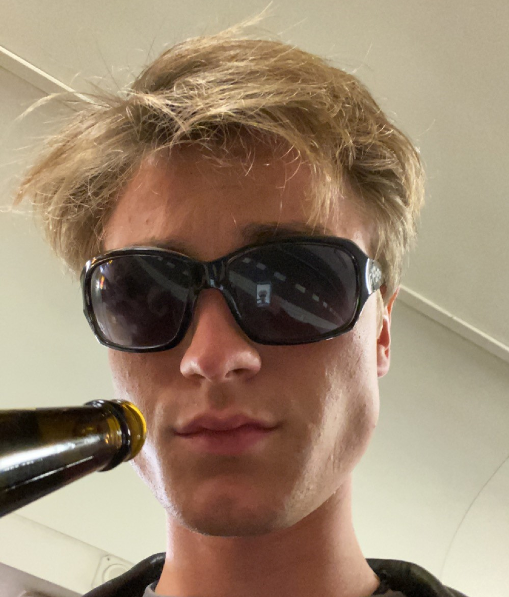
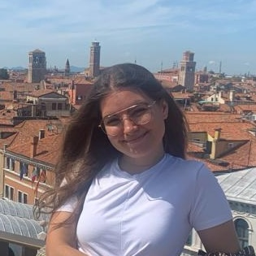
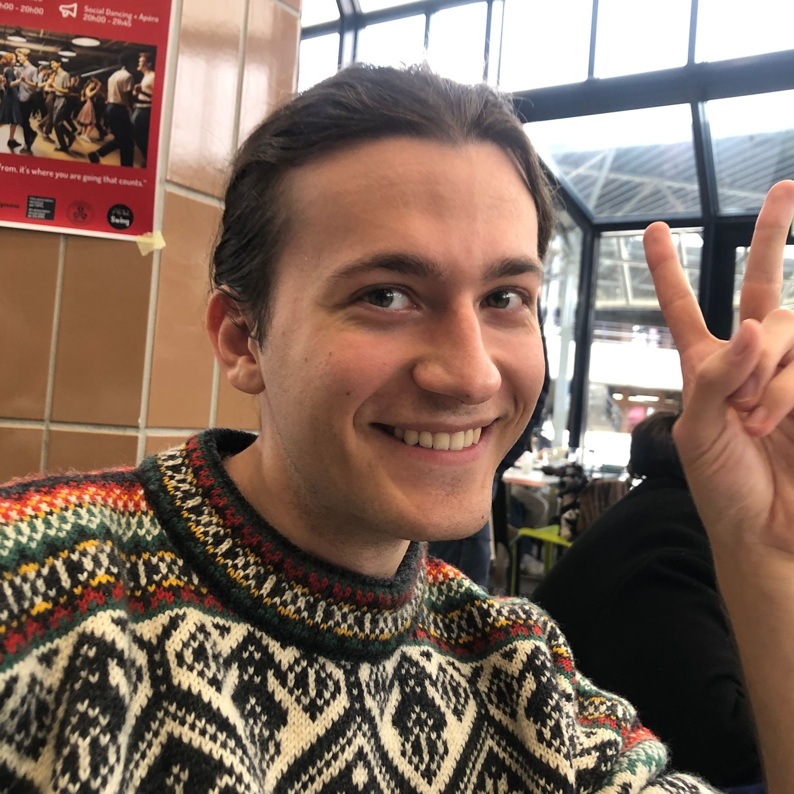

# About this project
This project was created in the frame of the Applied Data Analysis (ADA) course at EPFL. The goal was to tell a story with a dataset. 

# Who are we?
We are ADAcalypse! A jovial and boisterous team who had a lot of fun telling this little story... You want more details? Here they are:

   **Oscar Hellmuller**, who parallelized beautifully real events with the abstract pattern present in the dataset

   **Amine Benahmed**, who was ready to sacrifice real money to investigate the deepest layers of the dataset with the help of the API-GPT 4

   **Lena de Sepibus**, who was way too excited at the idea of telling a story - whatever if it's based on data

   **Olivia Ruggaber**, who was always there for help in the direst situation - and who made the nicest interactive plots of all

   **Orfeas Liossatos**, who hanged on his beloved _datetime_ type until everything crashed

