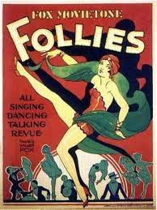
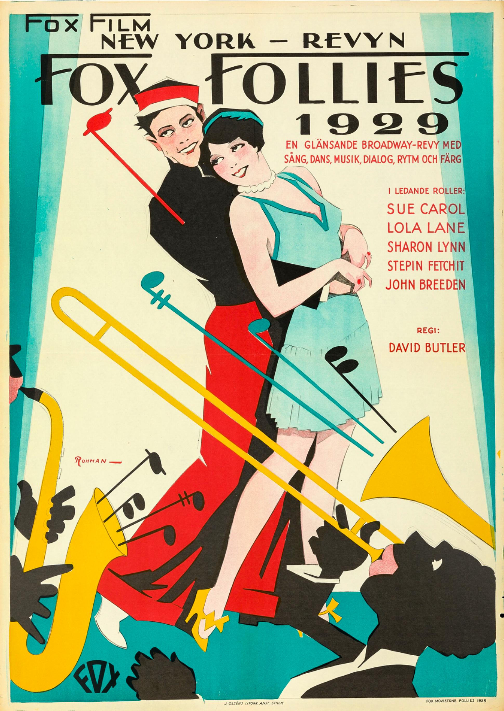
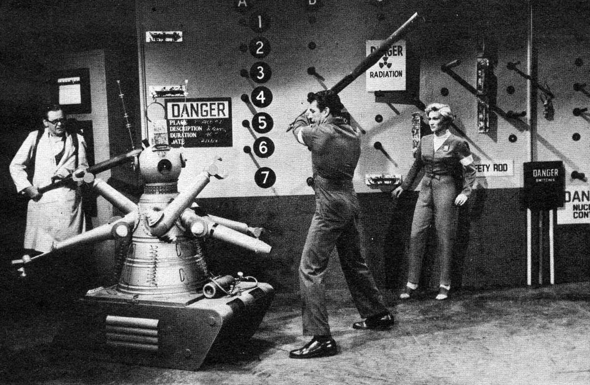
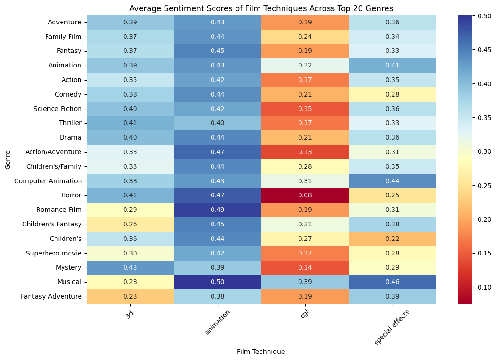

# In The Beginning

There was the void. Then came the big bang, which created all conditions needed for the emergence of the seventh art - filmmaking. However, it was not until the 17th century that its precursor, the magic lantern, and its coloured projections, was invented. [[1]]

<figure class="center">
   
   <figcaption>
    Illustration of Kircher's Steganographic mirror
    in his 1645 book <a href="https://books.google.nl/books?id=wYlDAAAAcAAJ&pg=PA792#v=onepage&q&f=false">Ars Magna Lucis et Umbrae</a>.
   </figcaption>
</figure>

## Moore’s Law in the movie industry 
A few years later, at the dawn of the 20th century, "Horse in Motion", one of the first chronophotographs, stirred up the crowds [[2]]. Then, with the advent of celluloid film, sequences became longer, more complex, and more popular until the birth of the movie industry. Technology is like a high-speed train traveling at full speed. One look at the number of films released over the last few decades suffices to notice its exponential expansion. 



Ever since, the development of cinema has been characterized by technological breakthroughs, for better and for worse. To examine how this technological evolution shaped the movie industry, we used the CMU Movie Corpus dataset [[3]], which contains 42,306 plot summaries along with their corresponding metadata extracted from Freebase. We believe that we should observe a two-fold impact of technology on our dataset: one is on the technology used to produce the movies in itself, thus impacting actor careers and film genres; the other is technology itself as a narrative theme appearing in plot summaries. We seek to measure, through a statistical and data-centered lens, this cultural evolution.

# I - How Technology Shaped The Movie Industry

## The emergence of sound and color

 <figure class="center">
 
<figcaption>
    When Dorothy enters the color world in "The Wizard of Oz" , 1939. <a href="https://www.imdb.com/title/tt0032138/?ref_=nv_sr_srsg_0_tt_8_nm_0_q_The%2520wizard%2520of%2520Oz"> IMDB page </a>
   </figcaption> 
</figure>

Widespread introduction of sound and colour in the 20s revolutionized the industry and correlates with the quick disappearance of silent and black-and-white movies.



In the face of this brutal change, actors need to adapt and seize new opportunities. But while some are able to change their acting style and technique, others miss the boat and the introduction of sound in the 30's thus mark an end to their sinking career. 

### Adapt – or perish

To investigate how this event changed the careers landscape of actors, we inspected all actors that have played in at least one silent film and then compared the proportion of silent and non-silent movie in which they starred. Naturally, age and death are critical confounders in this analysis, as these can also explain the end of a career. As we unfortunately do not have access to the actor's date of passing, we take advantage from their date of birth to improve our analysis by selecting only actors who performed their last silent film below the age of 40. How many of them « survived » the arrival of sound? 

In the pie graph below, the threshold parameter represents the ratio between the number of sound films and the number of silent films above which an actor is considered to have survived the transition. A threshold of 1 means that actors who have acted in at least as many sound films as silent films are considered to have survived. A threshold of 0.5 means that actors who have acted in twice as many sound films as silent films are considered to have survived.



But our analysis can still be improved! If we consider that most of these actors have only appeared in a handful of films, we can also consider that the survival rate might be influenced by another confounder, namely: a poor initial career. 



We then consider the following: the survival rate for actors who have acted in less than 5 silent films and actors that have acted in at least 5 silent films can be compared. We then find pairs across the two groups whose date of birth and age at last silent film exactly matches. For both groups, similarly as before, we observe the fraction of survivors: 



From this additional analysis we observe an interesting trend: actors that have starred in fewer films initially are less prone to have a declining career after the rising trend of synchronized film and score. While, a majority of established actors have trouble picking up their career.

### Some exceptions… 
<figure class="center">
  
  <figcaption> Charlie Chaplin in Modern Times <a href="https://www.imdb.com/title/tt0027977/"> IMDb </a> </figcaption>
</figure>

Nevertheless, some like Charlie Chaplin, who starred in 87 movies throughout his whole career, stay true to themselves amidst the chaos. Even with the growth and popularity of sound in movies, he decides to stay in his original realm: all of his movies are, according to the dataset, silent movies! Lucky us, because otherwise unforgettable classics like City of Light and Modern Times, whose criticism of technology is flagrant, wouldn't exist!

## The lost ones

But not all were so lucky. Silent movies became so unpopular that "Most of them did not survive because of wholesale junking by the studios. There was no thought of ever saving these films. They simply needed vault space and the materials were expensive to house." (Film preservationist Robert A. Harris [[4]])
In addition to that, movies usually were stored in flammable nitrate films before the 30s, which led to many unfortunate loss events: many movies turned to ash in vault fires, taking with them the collective memory of beloved stories and iconic stars… 
To track down these forgotten figures, we investigated another an external database from Wikidata [[5]] listing the most prominent lost films in the USA.



As the dataset is quite small and only considers the release date of the movies – and not their destruction date – we cannot infer much from the graph. But it is interesting to note that while many movies were lost until the 40s, it then became a very rare event thanks to the transition to safer storage films such as cellulose triacetate or polyester films. 
Who are the biggest losers amongst our dataset? A quick analysis revealed that up to fifteen actors played in more than one subsequently lost movie! Which lost movies did take the most actors with them in their fall?



So many forgotten figures! But while the original content is gone, proof of their popularity and impact on society still exist through some posters. Just look at these attracting depictions of "Fox Movietone Follies of 1929", wouldn't you want to watch it? [[6]][[7]]

    
    

## Remakes

Technology induced big changes, more safety, and a vaster realm of artistic opportunity! This leads to endless remakes of the most popular stories in the world, which can be retold in an infinity of new manners. Have a wild guess: which of these stories had the biggest impact?



If you have never heard of one of these, then you probably should look them up to better comprehend humanity. For this, you can either choose the original book, or one of its dozens of adaptations. With so many options, everyone should get something out of it, so no excuse to not enrich your cultural background! 

# II – Movies as reflection of technology development and public opinion

<figure class="center">
  
  <figcaption> Charlie Chaplin in Modern Times <a href="https://www.imdb.com/title/tt0027977/"> IMDb</a>
  </figcaption>
</figure>

Movies are not only impacted by technological advancements but are also a reflection of the world's innovation and the evolution of the minds of their creators. In the following plot down below, for example, we can clearly see the impact of real-world wars on the number of war films made during the last century. 


### High quality phrases

By searching though movie plot summaries, we can discover when certain technologies entered the public consciousness. but we must be careful! Early decades are often lacking in movie plot summaries. Therefore it is possible that there are even earlier movies where a given technology makes an appearance.



Despite this potential deficiency, we employed Autophrase [[8]] to extract high quality phrases (general entity names) from the plot summaries, and sorted them by TF-IDF score. We then find the earliest movies that contain one of these phrases in its summary and inspect them to understand the cultural context surrounding the term.

Importantly, aside from disallowing proper nouns and non-English words in the search, we do not explicitly constrain the search to technology. Nevertheless notable pieces of technology make the list of high quality words, highlighting their cultural relevance.

+ Modes of transport such as a **submarine** in *The Impossible Voyage (1904)*, **aircraft** in *Aero NT-54 (1925)*, a boat (**hull**) in *The Boat (1921)*, and a **jeep** in *Call Out the Marines (1941)*.
+ Nuclear fears are alive as early as the 50s with nuclear **fallout** in *The Day the World Ended (1955)*. 
+ Robots make an appearance with a **computerized** kitten in *Push-Button Kitty (1952)* and an **android** in *Frankenstein Meets the Space Monster (1965)*. 
+ Hypothetical technologies were also present with **cloning** in *Tintin and the Lake of Sharks (1972)*. 
+ Finally in the internet age,  *Hackers (1995)* features **downloading** files.



### Technology in real life and the movies

How does the development of technologies in real life compare to the percentage of movies that feature that technology? We simultaneously display the adoption of a given technology from the Historical Cross-Country Technology Adoption (HCCTA) Dataset [[9]], and the percentage of movies that year that included at least a synonym of the technological term.

<figure>

<figcaption> 
(*) Robots = industrial robots used in manufacturing sectors, aviation = passenger kilometers (millions), cars = privately owned vehicles (thousands), computers = PCs (thousands), phones = mainland phones (thousands). Telegraph = number of telegrams (thousands). The following countries are included :   
Australia, Austria, Belgium, Canada, Denmark, Finland, France, New Zealand,
  
Germany, Greece, Iceland, Ireland, Italy, Japan, Luxembourg, Netherlands,
 
Norway, Portugal, Spain, Sweden, Switzerland, United Kingdom, United States of America
</figcaption>
</figure>
We observe that for many technologies, the proportion of movies that feature them has been significantly and steadily increasing throughout the years. Take the computer, whose earliest appearance in the dataset is with *Gog (1954)*, a science fiction film about a computer gone rogue. [[10]] By the year 2000, up to 2% of movies feature a computer in some way.

<figure class="center">
   
   <figcaption>
    Scene with Dr. David Sheppard and his flamethrower against the robot, 1954. <a href="https://www.imdb.com/title/tt0047033/"> IMDB page </a>
   </figcaption>
</figure>

We also note how most technologies feature in movies before they become widely commercially available. This speaks to the how technologies are an object of fascination and speculation. At the same time, technologies in disuse such as the telegraph gain do not feature widely in films aside from when they are historically and thematically relevant like in the coming of age movie *The Tree of Life (2011)* in which a woman in the 1960s receives a telegram announcing her son's death. [[11]]

But how well do movies reflect the reality of technology breakthrough and evolution? In other words, how does the emergence of these technologies _correlate_ with their presence in the movie industry? To answer this questiom, we computed a generalized measure of correlation, the maximum information coefficient (MIC), separately for different countries' movie and technological industries. [[12]]

    

For example, the USA has a high mutual information coefficient for the technologies considered. Put simply, USA's cinema industry (hollywood) is highly reactive when it comes to the introduction of real life technologies.
Now, what about the feelings towards theses technological advancement and their impact on society? To discover this, we ran a sentiment analysis on both plot summaries and movie reviews taken from Rotten Tomatoes [[13]]. 

## Sentiment analysis on movie summaries

Thanks to our 6th group member ChatGPT, we were able to produce a list of words related to technology. For each word, we computed the average sentiment score considering its context in each summary. You can see below the top ten words used in a positive context in movies, as well as the top ten most negatively connotated words. 



For example, “avatar” paints of a picture of an idealized virtual world, whereas on the on the other end of the spectrum, a word like virus would appear in apocalyptic scenarios. 
<figure class="center">
    
    <figcaption> "Avatar", 2009. <a href="https://www.imdb.com/title/tt0499549"> IMDB page </a>
     </figcaption>
    
    <figcaption> "The Walking Dead", 2010-2022. <a href="https://www.imdb.com/title/tt1520211"> IMDB page </a>
     </figcaption>
</figure>

But how have opinions evolved about technology in movies?

## Sentiment analysis on movie reviews
Below, we observe reviews where technology such as CGI, VFX, etc. are mentioned. The same contextual analysis as before is performed with a rolling average over five years. 
We observe a rather stable score around 0.25, which means that reviewers are on average slightly positive about technology used to create movies.



And how does this picture change for specific genres? Take for example Thrillers, Science Fiction movies, Action / Adventure and Adventure movies. 



We notice a general negative tendency for movies released in the 1970s. Why could that be? Perhaps an overly-ambitious use of technologies that have aged like milk, or the premature introduction of new technologies? In reality, in the 1970s many novel technologies appeared on the big screen for the first time, to modest reception, such as 2D computer graphics in *Westworld (1973)* and 3D computer graphics in *Futureworld (1976)*. [[14]]

Although average trends seem to indicate stable positive sentiment, zooming in to specific movies with heavy use of special effects and/or animation reveals a different story. Critic opinions about technology seem to take a nose-dive after around 10 years. This seems like a common perception to have. Indeed, as we get used to the latest, up-to date developements in CGIs and special effects, we might find poorly made or even ridiculous some effects in older films, thus decreasing the overall sentiment scores.



Star Wars Episode I: The Phantom Menace (1999) is a particularly striking example of this phenomenon, where motion-captured CGI characters such as Jar-Jar Binks paved the way to later characters such as Gollum in The Lord of the Rings (2001). Nowadays Binks is regarded as slightly uncanny.

<figure class = "center" >
  
  <figcaption>
  Jar Jar Binks in "Star Wars Episode I: The Phantom Menace", 1999. <a href="https://www.imdb.com/title/tt0120915"> IMDB page </a>
   </figcaption>
</figure>

It remains to verify whether the difference of scores after a decade for those particular movies is statistically significant. We balance the set of reviews into two sets: reviews written within 10 years of the movie release, and reviews written at least 10 years after the movie release. Then we perform a T-test to determine whether the means are statistically different with 95% confidence. 


The results are clear - with the Phantom Menace and the Prince of Egypt having depreciated in critical opinion. Similarly, we can observe how the sentiment might change for a specific technique over the years.
We can notice that mostly techniques have a rather positive sentiment that slightly varies across release years. 



However, only CGI reached a negative peak around the 1990’s. What has happened at this time to have induced such horror? In fact, it seems to be the “break-out” decade for the use of CGI, where movies such as Terminator 2: Judgment Day popularized such a technique [[15]]. As such, one might imagine that a rise in popularity correlates with an increase of low budget and bad quality computer generated frames for the sake of hopping on the bandwagon. Similarly, we observe a general increase of sentiment score in more recent films using 3D computer graphics.

To better understand the sentiment of different techniques overall, we can plot the distribution of sentiment scores for each technique regardless of the release date of each movie. 



We can see that the distribution of sentiment score is generally trimodal: a part of the reviewers seem to be very enthusiastic about techniques (score of 1), another very skeptical (score of -1) and a majority of reviewers are modestly positive. This distribution seems to be illustrate real-life divergence of opinions. 

On the following heatmap, we observe the correlation between sentiment scores of genres and different techniques used in films.

<figure class="center">
    
</figure>

Starting from the two extremes sentiment scores of this heatmap,  we see that the lowest score is 0.08 in the horror-cgi category. It makes sense, after all, who hasn’t seen ridiculous, disappointing effects in horror films? As for the highest scoring sentiment category, we find the musical-animation pair, with a staggering 0.5. The influence of Disney cannot be understated in this category, who pioneered the animated musical genre.

# Final thoughts

By unraveling the ties between technology and the exploding movie industry, we have made several surprising discoveries. New storage formats have preserved our cultural heritage from an age of silent and black-and-white films, where many careers were snuffed out after the transition to sound and color. Real world developments such as wars insert themselves into the minds of film creators, nestled alongside speculations of future technologies. As narrative elements, technologies adapt both positive and negative roles, which speaks to their cultural influence. As tools for creating movies, technology elicits both extreme negative reactions from skeptical critics, and positive reactions from the open-minded. Overall, the interplay of technology and cinema provides rich grounds for cultural investigation, which we found deep pleasure in uncovering.

# References

This work would not have been possible without the datasets and code libraries from the following sources.

- [[dataset][9]] Historical Cross-Country Technology Adoption (HCCTA) Dataset. [[article][7]] Comin, D. and Hohijn B., **Cross-Country Technological Adoption: Making the Theories Face the Facts**. Journal of Monetary Economics, January 2004, pp. 39-83.

- [[library][A]] luozhouyang/AutoPhraseX. **Automatic Phrase Mining from Massive Text Corpora in Python**.

- [[article][8]] Jingbo Shang, Jialu Liu, Meng Jiang, Xiang Ren, Clare R Voss, Jiawei Han, **Automated Phrase Mining from Massive Text Corpora**, accepted by IEEE Transactions on Knowledge and Data Engineering, Feb. 2018.

- [[article][B]] Jialu Liu*, Jingbo Shang*, Chi Wang, Xiang Ren and Jiawei Han, **Mining Quality Phrases from Massive Text Corpora**, Proc. of 2015 ACM SIGMOD Int. Conf. on Management of Data (SIGMOD'15), Melbourne, Australia, May 2015. (* equally contributed, slides)

- [[article][C]] Lee, Daniel, Huilai Miao, and Yuxuan Fan. **Analyzing Movies Using Phrase Mining**. (2021).

- [[dataset][D]] Geographic plots made with **Natural Earth**.

- [[dataset][3]] CMU Movie Summary Corpus. [[article][E]]**Learning Latent Personas of Film Characters**
David Bamman, Brendan O'Connor, and Noah A. Smith
ACL 2013, Sofia, Bulgaria, August 2013

- [[library][F]] minepy/minepy. **Maximal Information-based Non-parametric Exploration**. [[article][12]] Davide Albanese, Samantha Riccadonna, Claudio Donati, Pietro Franceschi, **A practical tool for maximal information coefficient analysis**, GigaScience, Volume 7, Issue 4, April 2018, giy032.

- [[image][G]] By Athanasius Kircher, Public Domain

- [[website][10]] Wikipedia **Gog** (film)

- [[website][11]] Wikipedia **The Tree of Life** (film)

- [[dataset][13]] Kaggle - Rotten Tomatoes movies and critic reviews dataset.

- [[website][14]] Wikipedia **Timeline of Computer Animation**

- [[website][15]] Wikipedia **History of Computer animation**

- [[image][H]] The cover art can be obtained from Movieposterdb.com., Fair use.

- [[image][7]] Obtained from IMDb.

- [[website][2]] Wikipedia **History of film technology**

- [[website][4]] Wikipedia **Lost Film**

- [[dataset][5]] Wikipedia **List of lost films**

[9]: https://www.nber.org/research/data/historical-cross-country-technology-adoption-hccta-dataset
[7]: https://github.com/luozhouyang/AutoPhraseX
[8]: https://arxiv.org/abs/1702.04457
[A]: https://hanj.cs.illinois.edu/pdf/sigmod15_jliu.pdf
[B]: https://dsc-capstone.org/projects-2020-2021/reports/project_42.pdf
[C]: https://www.naturalearthdata.com/
[D]: https://www.sciencedirect.com/science/article/pii/S0304393203001247
[3]: https://www.cs.cmu.edu/~ark/personas/
[E]: https://www.cs.cmu.edu/~dbamman/pubs/pdf/bamman+oconnor+smith.acl13.pdf
[12]: https://doi.org/10.1093/gigascience/giy032
[F]: https://github.com/minepy/minepy
[11]: https://commons.wikimedia.org/w/index.php?curid=52666213
[10]: https://en.wikipedia.org/wiki/Gog_(film)
[11]: https://en.wikipedia.org/wiki/The_Tree_of_Life_(film)
[13]: https://www.kaggle.com/datasets/stefanoleone992/rotten-tomatoes-movies-and-critic-reviews-dataset/data?select=rotten_tomatoes_critic_reviews.csv
[14]: https://en.wikipedia.org/wiki/Timeline_of_computer_animation_in_film_and_television
[15]: https://en.wikipedia.org/wiki/History_of_computer_animation 
[H]: https://en.wikipedia.org/w/index.php?curid=33807800
[7]: https://www.imdb.com/title/tt0019896/
[2]: https://en.wikipedia.org/wiki/History_of_film_technology
[4]: https://en.wikipedia.org/wiki/Lost_film
[5]: https://en.wikipedia.org/wiki/List_of_lost_films